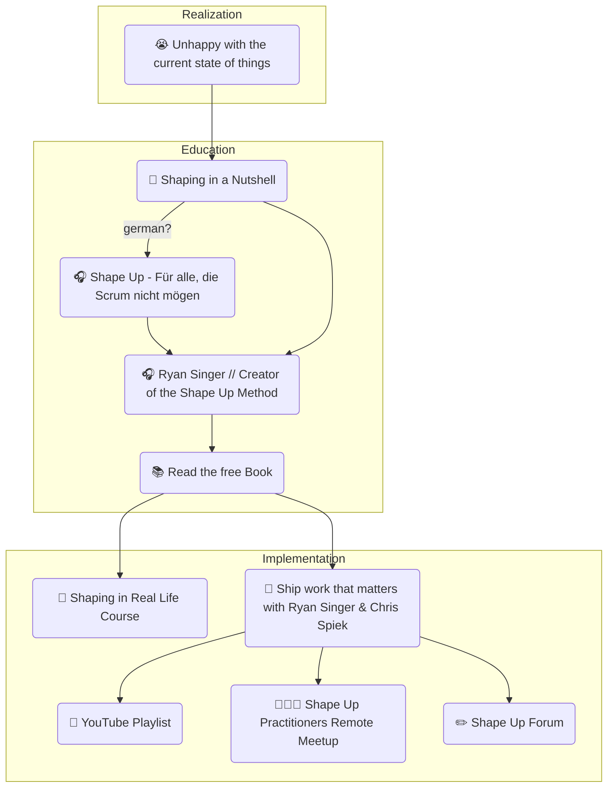

# Shape Up Learning Path

```mermaid
graph TD
    subgraph Realization
        U("😭 Unhappy with the current state of things")
    end

    subgraph Education 
        A("🍿 Shaping in a Nutshell")
        SDDC("🎧 Shape Up - Für alle, die Scrum nicht mögen")
        B("📚 Read the free Book")
        AL("🎧 Ryan Singer // Creator of the Shape Up Method")
    end

    subgraph Implementation 

        P("🍿 YouTube Playlist")
        M("🧑🏻‍💻 Shape Up Practitioners Remote Meetup")
        R("🤙 Shaping in Real Life Course")
        S("🍿 Ship work that matters with Ryan Singer & Chris Spiek")
        F("✏️ Shape Up Forum")
    end


U --> A
A -->|german?| SDDC
SDDC --> AL
A --> AL
S--> M
B --> R
B --> S
S --> F
S --> P
AL --> B

click AL "https://alphalist.com/podcast/65-ryan-singer-creator-of-the-shape-up-method" _blank
click A "https://www.youtube.com/watch?v=h_8M23wVjXk" _blank
click SDDC "https://superdev.club/podcasts/shape-up/" _blank
click B "https://basecamp.com/shapeup" _blank
click M "https://www.meetup.com/de-DE/shapeup-practitioners/" _blank
click R "https://feltpresence.com/srl/" _blank
click F "https://youtu.be/jnW0fAIpLbo" _blank
click D "https://discourse.learnshapeup.com/" _blank
click P "https://youtu.be/h_8M23wVjXk" _blank
click S "https://www.youtube.com/watch?v=jnW0fAIpLbo" _blank
```

