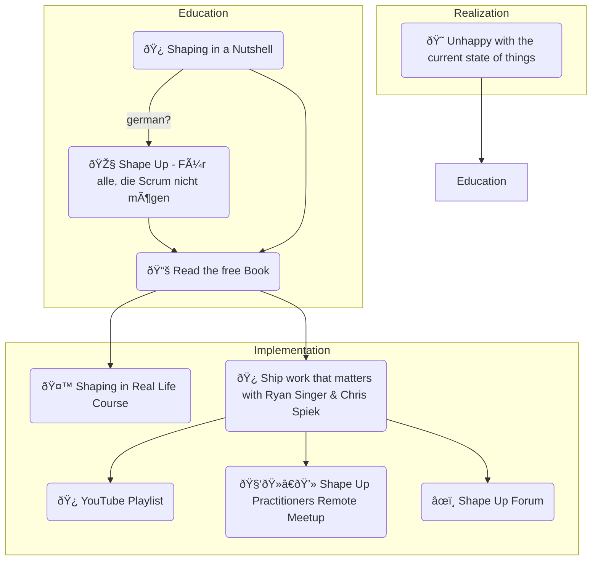

# Shape Up Learning Path

```mermaid
graph TD
    subgraph Realization
        U("😭 Unhappy with the current state of things")
    end

    subgraph Education 
        A("🿠Shaping in a Nutshell")
        SDDC("🎧 Shape Up - Für alle, die Scrum nicht mögen")
        B("📚 Read the free Book")
    end

    subgraph Implementation 

        P("🿠YouTube Playlist")
        M("🧑ðŸ»â€ðŸ’» Shape Up Practitioners Remote Meetup")
        R("🤙 Shaping in Real Life Course")
        S("🿠Ship work that matters with Ryan Singer & Chris Spiek")
        F("âœï¸ Shape Up Forum")
    end


U --> Education
A -->|german?| SDDC
SDDC --> B
A --> B
S--> M
B --> R
B --> S
S --> F
S --> P

click A "https://www.youtube.com/watch?v=h_8M23wVjXk" _blank
click SDDC "https://superdev.club/podcasts/shape-up/" _blank
click B "https://basecamp.com/shapeup" _blank
click M "https://www.meetup.com/de-DE/shapeup-practitioners/" _blank
click R "https://feltpresence.com/srl/" _blank
click F "https://youtu.be/jnW0fAIpLbo" _blank
click D "https://discourse.learnshapeup.com/" _blank
click P "https://www.youtube.com/watch?v=h_8M23wVjXk&list=PLh2qZ3Zp-Xw2Q-H3lSjkEPhBYzvkDt6mY" _blank
```

